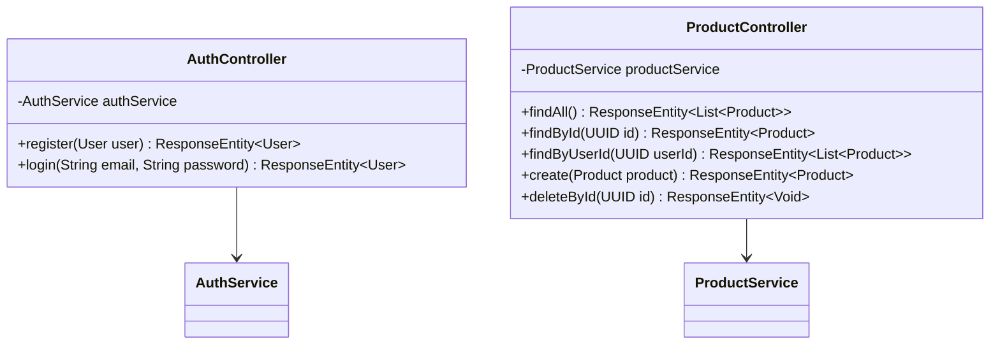

```mermaid
classDiagram
    class AuthController {
        -AuthService authService
        +register(User user) ResponseEntity~User~
        +login(String email, String password) ResponseEntity~User~
    }

    class ProductController {
        -ProductService productService
        +findAll() ResponseEntity~List~Product~~
        +findById(UUID id) ResponseEntity~Product~
        +findByUserId(UUID userId) ResponseEntity~List~Product~~
        +create(Product product) ResponseEntity~Product~
        +deleteById(UUID id) ResponseEntity~Void~
    }

    AuthController --> AuthService
    ProductController --> ProductService
```
