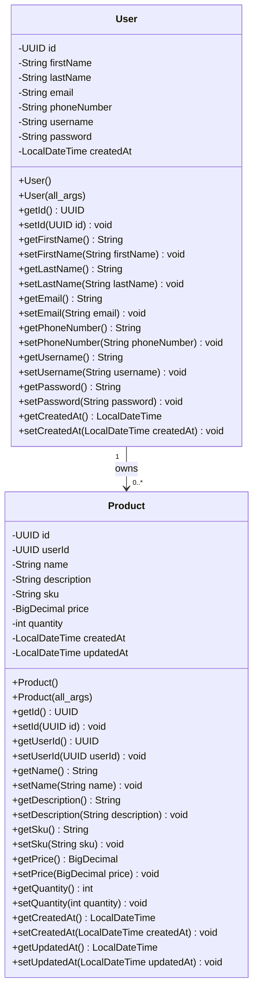

```mermaid
classDiagram
    class User {
        -UUID id
        -String firstName
        -String lastName
        -String email
        -String phoneNumber
        -String username
        -String password
        -LocalDateTime createdAt
        +User()
        +User(all_args)
        +getId() UUID
        +setId(UUID id) void
        +getFirstName() String
        +setFirstName(String firstName) void
        +getLastName() String
        +setLastName(String lastName) void
        +getEmail() String
        +setEmail(String email) void
        +getPhoneNumber() String
        +setPhoneNumber(String phoneNumber) void
        +getUsername() String
        +setUsername(String username) void
        +getPassword() String
        +setPassword(String password) void
        +getCreatedAt() LocalDateTime
        +setCreatedAt(LocalDateTime createdAt) void
    }

    class Product {
        -UUID id
        -UUID userId
        -String name
        -String description
        -String sku
        -BigDecimal price
        -int quantity
        -LocalDateTime createdAt
        -LocalDateTime updatedAt
        +Product()
        +Product(all_args)
        +getId() UUID
        +setId(UUID id) void
        +getUserId() UUID
        +setUserId(UUID userId) void
        +getName() String
        +setName(String name) void
        +getDescription() String
        +setDescription(String description) void
        +getSku() String
        +setSku(String sku) void
        +getPrice() BigDecimal
        +setPrice(BigDecimal price) void
        +getQuantity() int
        +setQuantity(int quantity) void
        +getCreatedAt() LocalDateTime
        +setCreatedAt(LocalDateTime createdAt) void
        +getUpdatedAt() LocalDateTime
        +setUpdatedAt(LocalDateTime updatedAt) void
    }

    User "1" --> "0..*" Product : owns
```