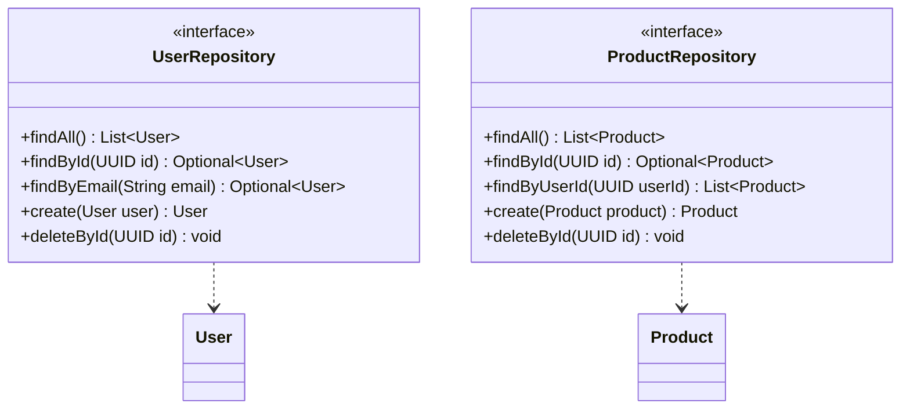

```mermaid
classDiagram
    class UserRepository {
        <<interface>>
        +findAll() List~User~
        +findById(UUID id) Optional~User~
        +findByEmail(String email) Optional~User~
        +create(User user) User
        +deleteById(UUID id) void
    }

    class ProductRepository {
        <<interface>>
        +findAll() List~Product~
        +findById(UUID id) Optional~Product~
        +findByUserId(UUID userId) List~Product~
        +create(Product product) Product
        +deleteById(UUID id) void
    }

    UserRepository ..> User
    ProductRepository ..> Product
```
