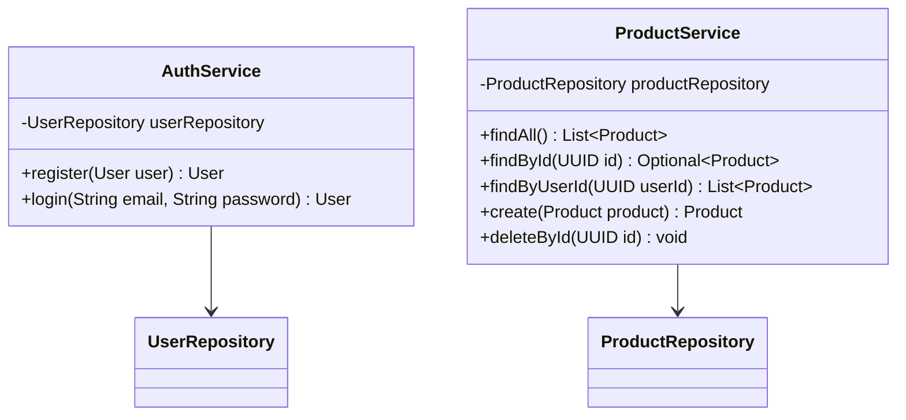

```mermaid
classDiagram
    class AuthService {
        -UserRepository userRepository
        +register(User user) User
        +login(String email, String password) User
    }

    class ProductService {
        -ProductRepository productRepository
        +findAll() List~Product~
        +findById(UUID id) Optional~Product~
        +findByUserId(UUID userId) List~Product~
        +create(Product product) Product
        +deleteById(UUID id) void
    }

    AuthService --> UserRepository
    ProductService --> ProductRepository
```
